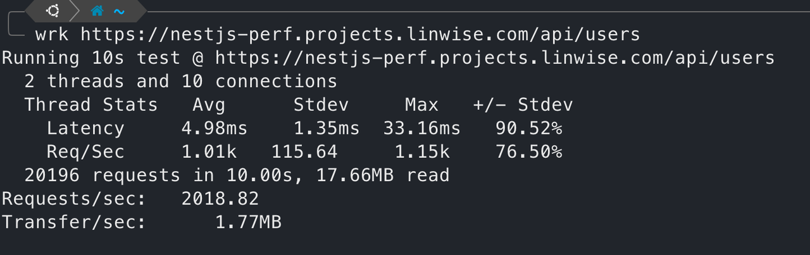
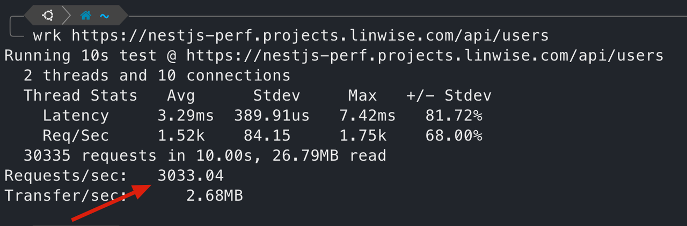
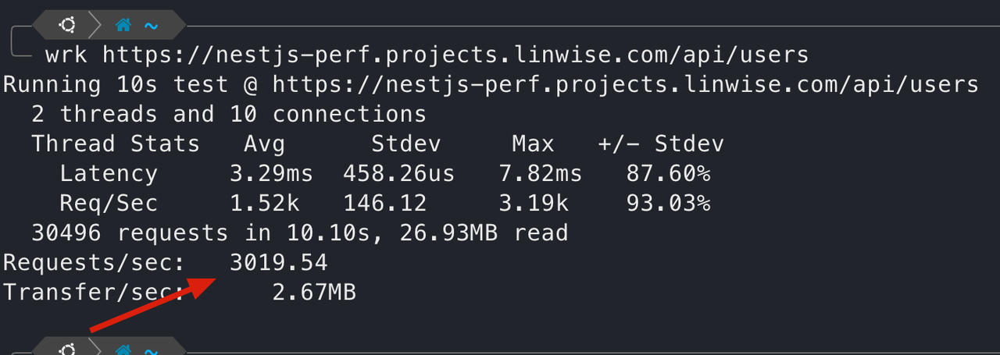
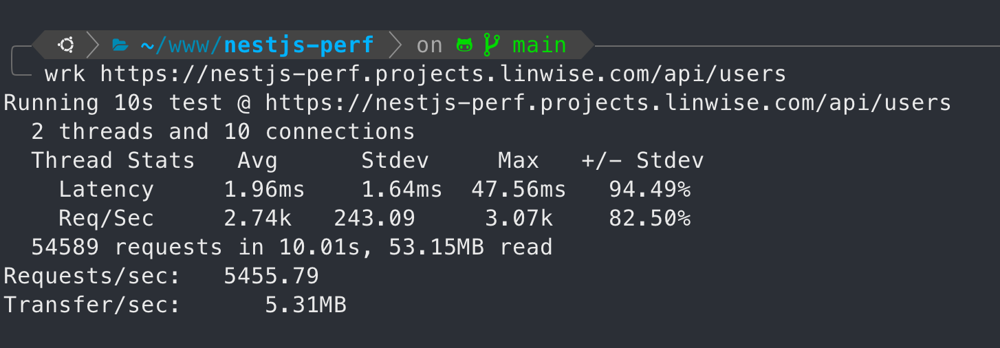

# Simple Nest.js Performance Test

> Nest.js 11 from https://nestjs.com/
>
> App running on 4c8g 20hdd AWS EC2 VPS.
>
> PostgresSQL 16.8 db.
>
> Requests are sent from the same server.
>
> Prisma ORM 6.5.

## Screenshots

### get users 2000+ rps

### get users with memory cache 3000+ rps

### get users with redis cache 3000+ rps

### get users with redis cache, with 4 nest.js app instances,  5400+ rps

## License

Nest is [MIT licensed](https://github.com/nestjs/nest/blob/master/LICENSE).
